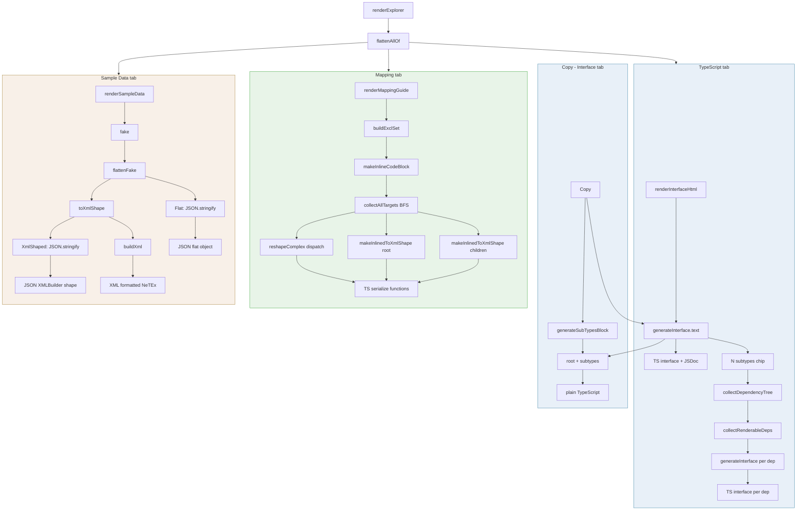

# Schema Viewer Codegen Flow

How each tab renders its output — from user click to formatted code.

## Output Summary

| Output | Format | Tab | Codegen Function |
|--------|--------|-----|-----------------|
| Main interface | TypeScript | TypeScript | `generateInterface` |
| Subtypes | TypeScript | TypeScript | `generateInterface` + `generateSubTypesBlock` |
| Serialize functions | TypeScript | Mapping | `makeInlineCodeBlock` / `makeInlinedToXmlShape` |
| Flat stem object | JSON | Sample Data | `flattenFake` (via `fake`) |
| XMLBuilder shape | JSON | Sample Data | `toXmlShape` |
| Formatted NeTEx | XML | Sample Data | `buildXml` |
